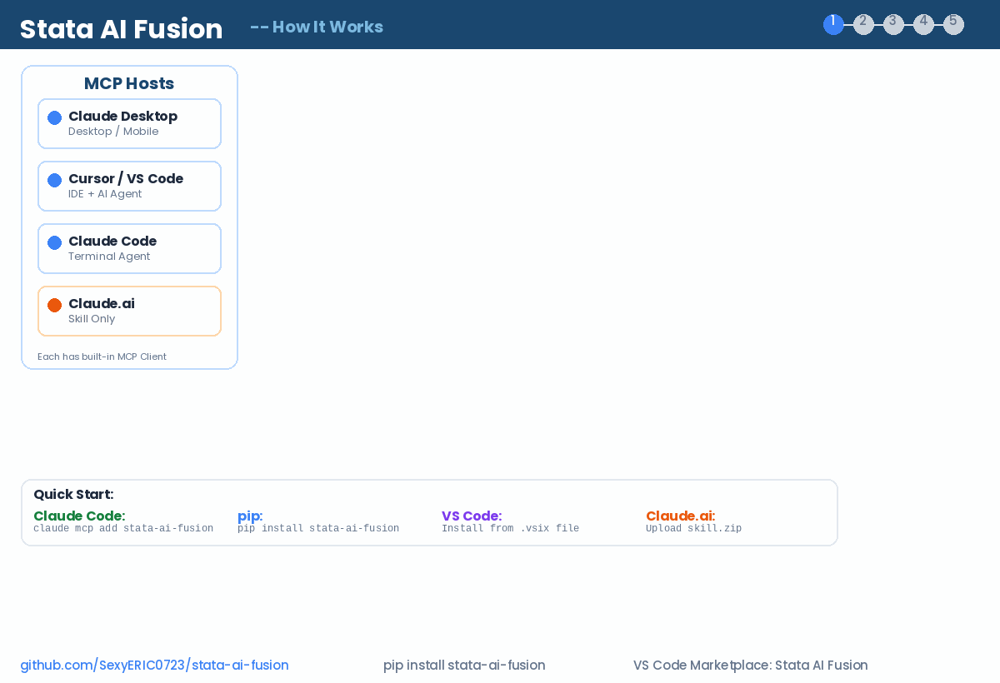

<div align="center">
  
  <h1>Stata AI Fusion</h1>
  <p><strong>MCP Server + Skill Knowledge Base + VS Code Extension for Stata</strong></p>
  <p>Let AI directly execute Stata code, generate publication-quality analysis, and provide a complete IDE experience.</p>

  [](https://pypi.org/project/stata-ai-fusion/)
  [](LICENSE)
  [](https://www.python.org/downloads/)
  [](https://marketplace.visualstudio.com/items?itemName=statafusion.stata-ai-fusion)

  <p>
    <a href="#quick-start">Quick Start</a> &bull;
    <a href="#features">Features</a> &bull;
    <a href="#mcp-tools-reference">MCP Tools</a> &bull;
    <a href="#skill-knowledge-base">Skill Knowledge</a> &bull;
    <a href="#vs-code-extension">VS Code Extension</a> &bull;
    <a href="README_CN.md">中文文档</a>
  </p>
</div>

---

## Why Stata AI Fusion?

Stata is one of the most widely used statistical packages in economics, political science, epidemiology, and biostatistics. Yet while R and Python users have enjoyed deep AI integration for years, Stata has remained isolated from the AI-assisted coding revolution.

**stata-ai-fusion** bridges that gap. It gives AI assistants (Claude, Cursor, GitHub Copilot, and others) the ability to start a real Stata session, run commands, inspect data, extract estimation results, and capture graphs -- all through the open [Model Context Protocol](https://modelcontextprotocol.io/) (MCP).

The project ships as three complementary components so every workflow is covered:

| Component | What it does | Who it's for |
|-----------|-------------|--------------|
| **MCP Server** | 10 tools that let any MCP-compatible AI execute Stata | Claude Desktop, Claude Code, Cursor users |
| **Skill Knowledge Base** | 5,653 lines of Stata expertise the AI can consult | Claude.ai Project / Skill users |
| **VS Code Extension** | Syntax highlighting, snippets, run-in-terminal | Anyone writing `.do` files in VS Code or Cursor |

---

## Architecture

<p align="center">
  
</p>

The data flow is straightforward:

1. **AI Assistant** sends a tool call (e.g. `run_command`) via MCP.
2. **MCP Server** dispatches the request to the **Session Manager**, which maintains one or more persistent, interactive Stata processes.
3. **Stata** executes the command; the server captures output, strips SMCL markup, detects errors, and auto-exports any new graphs.
4. The cleaned result (text + optional base64 image) flows back to the AI, which interprets it and responds to the user.

---

## Quick Start

### Claude Code (recommended)

```bash
# Register the MCP server in one command
claude mcp add stata-ai-fusion -- uvx --from stata-ai-fusion stata-ai-fusion

# Verify
claude mcp list
```

Then try:

```
> Load the auto dataset in Stata and regress price on mpg and weight with robust SE
```

### Claude Desktop

Edit your config file:

- **macOS**: `~/Library/Application Support/Claude/claude_desktop_config.json`
- **Windows**: `%APPDATA%\Claude\claude_desktop_config.json`

```json
{
  "mcpServers": {
    "stata": {
      "command": "uvx",
      "args": ["--from", "stata-ai-fusion", "stata-ai-fusion"]
    }
  }
}
```

Restart Claude Desktop. The Stata tools will appear in the tool list.

### Cursor / VS Code (MCP)

Create `.cursor/mcp.json` or `.vscode/mcp.json` in your project root:

```json
{
  "servers": {
    "stata": {
      "command": "uvx",
      "args": ["--from", "stata-ai-fusion", "stata-ai-fusion"]
    }
  }
}
```

### Claude.ai (Skill Only)

This mode provides code-generation guidance only (no live Stata execution).

1. Download `stata-ai-fusion-skill.zip` from the [Releases](https://github.com/SexyERIC0723/stata-ai-fusion/releases) page.
2. Go to **Claude.ai > Project > Project Knowledge > Upload**.
3. Upload the zip file.

The AI will now reference the 5,653-line knowledge base when writing Stata code for you.

### VS Code Extension

```bash
# Option 1: VS Code Marketplace
# Search "Stata AI Fusion" in the Extensions panel

# Option 2: From GitHub Release
code --install-extension stata-ai-fusion-0.1.2.vsix

# Option 3: Cursor
cursor --install-extension stata-ai-fusion-0.1.2.vsix
```

---

## Features

### MCP Server -- 10 tools for AI-driven analysis

The server exposes 10 MCP tools. Each tool can be called by any MCP-compatible AI assistant.

#### Conversation Example

```
User: "Analyze the determinants of car prices in the auto dataset."

AI calls: run_command("sysuse auto, clear")
AI calls: inspect_data()                          -> 74 obs, 12 variables
AI calls: run_command("regress price mpg weight foreign, robust")
AI calls: get_results("e", "N r2 F")              -> N=74, R²=0.52, F=29.1
AI calls: run_command("scatter price mpg || lfit price mpg")
AI calls: export_graph(format="png")               -> [base64 image]

AI: "The regression shows that each additional mile per gallon is associated
     with a $49.50 decrease in price, controlling for weight and origin..."
```

### Skill Knowledge Base -- 5,653 lines of Stata expertise

The knowledge base uses a **Progressive Disclosure** architecture:

- **SKILL.md** (486 lines) serves as the entry-point router.
- **14 reference files** cover specific domains; the AI loads them on demand.
- The AI never reads all 5,653 lines at once -- it fetches only what the current task requires.

### VS Code Extension -- complete Stata IDE

| Feature | Shortcut | Description |
|---------|----------|-------------|
| Run Selection | `Cmd+Shift+Enter` | Execute selected Stata code in the terminal |
| Run File | `Cmd+Shift+D` | Execute the entire `.do` file |
| Syntax Highlighting | -- | 25 grammar scopes covering commands, functions, macros |
| Code Snippets | `Tab` | 30 snippets (`reg`, `merge`, `foreach`, `esttab`, ...) |
| Graph Preview | -- | View Stata graphs inside VS Code |
| Auto MCP Config | -- | Auto-generate `.vscode/mcp.json` for Cursor/VS Code |

---

## MCP Tools Reference

| Tool | Description | Example |
|------|-------------|---------|
| `run_command` | Execute Stata code and return output | `run_command(code="regress price mpg weight, robust")` |
| `run_do_file` | Run an entire `.do` file | `run_do_file(path="/path/to/analysis.do")` |
| `inspect_data` | Describe the current dataset in memory | Returns obs count, variable names, types, labels |
| `codebook` | Generate codebook for specific variables | `codebook(variables="price mpg foreign")` |
| `get_results` | Extract stored results (r/e/c class) | `get_results(result_class="e", keys="N r2")` |
| `export_graph` | Export current graph as PNG/SVG/PDF | Returns base64-encoded image data |
| `search_log` | Search through the Stata session log | `search_log(query="error", regex=true)` |
| `install_package` | Install SSC or user-written packages | `install_package(package="reghdfe")` |
| `list_sessions` | List all active Stata sessions | Returns session IDs, types, alive status |
| `close_session` | Close a specific Stata session | `close_session(session_id="default")` |

---

## Skill Knowledge Base

| Reference | Lines | Coverage |
|-----------|------:|----------|
| `syntax-core.md` | 564 | Commands, data types, operators, macros |
| `data-management.md` | 481 | merge, reshape, append, collapse, encode |
| `econometrics.md` | 412 | OLS, IV, panel data, GMM, quantile regression |
| `causal-inference.md` | 433 | DiD, RDD, synthetic control, IPW, event study |
| `survival-analysis.md` | 332 | stset, stcox, streg, competing risks, KM curves |
| `clinical-data.md` | 497 | MIMIC-IV, ICD-9/10, KDIGO, Sepsis-3, LOS |
| `graphics.md` | 463 | twoway, graph options, schemes, export |
| `tables-export.md` | 348 | esttab, putdocx, collect, LaTeX/Word output |
| `error-codes.md` | 349 | Common Stata errors with causes and fixes |
| `defensive-coding.md` | 389 | assert, capture, confirm, isid, tempfiles |
| `mata.md` | 532 | Mata programming, matrices, optimization |
| `packages/reghdfe.md` | 127 | High-dimensional fixed effects regression |
| `packages/coefplot.md` | 133 | Coefficient and event-study plots |
| `packages/gtools.md` | 107 | Fast data operations (gcollapse, gegen) |
| **Total** | **5,653** | |

---

## Configuration

| Variable | Default | Description |
|----------|---------|-------------|
| `STATA_PATH` | Auto-detect | Full path to the Stata executable |
| `MCP_STATA_LOGLEVEL` | `INFO` | Logging level (`DEBUG` / `INFO` / `WARNING`) |
| `MCP_STATA_TEMP` | System temp | Base directory for session temporary files |

---

## Stata Auto-Discovery

The server automatically detects your Stata installation using a three-tier strategy:

1. **Environment variable** -- `STATA_PATH` takes highest priority.
2. **Standard paths** --
   - macOS: `/Applications/Stata*/`, `/Applications/StataNow/`
   - Linux: `/usr/local/stata*/`, `/usr/local/bin/`
   - Windows: `C:\Program Files\Stata*\`
3. **System PATH** -- `which stata-mp`, `which stata-se`, `which stata`

Supported editions: **MP**, **SE**, **IC**, **BE** (Stata 17, 18, 19 and StataNow).

If auto-detection fails, set the environment variable explicitly:

```bash
export STATA_PATH="/Applications/Stata/StataMP.app/Contents/MacOS/stata-mp"
```

---

## Multi-Session Support

The server supports multiple concurrent Stata sessions with complete data isolation:

- Each session maintains its own dataset, variables, and estimation results.
- Sessions persist between tool calls -- no need to reload data after every command.
- A default session is created automatically; create named sessions for parallel workflows.
- All sessions are cleaned up gracefully on server shutdown.

```
AI calls: run_command(code="sysuse auto, clear", session_id="session_A")
AI calls: run_command(code="sysuse nlsw88, clear", session_id="session_B")
# session_A has 74 obs (auto), session_B has 2,246 obs (nlsw88)
```

---

## Development

```bash
# Clone and set up
git clone https://github.com/SexyERIC0723/stata-ai-fusion.git
cd stata-ai-fusion
uv sync

# Run unit tests (no Stata required)
uv run pytest tests/test_discovery.py -v

# Run integration tests (requires Stata)
uv run pytest tests/test_integration.py -v

# Build Python package
uv build

# Build VS Code extension
cd vscode-extension && npm install && npm run build
```

---

## Testing

| Test Suite | Count | Requires Stata |
|------------|------:|:--------------:|
| `test_discovery.py` | 39 | No |
| `test_integration.py` | 46 | Yes |
| **Total** | **85** | |

All 85 tests pass on Stata MP 19 (macOS arm64).

---

## Project Structure

```
stata-ai-fusion/
├── src/stata_ai_fusion/
│   ├── __main__.py          # CLI entry point
│   ├── server.py            # MCP server + resource registration
│   ├── stata_discovery.py   # Auto-detect Stata installation
│   ├── stata_session.py     # Interactive & batch session manager
│   ├── graph_cache.py       # Graph capture and base64 encoding
│   ├── result_extractor.py  # r()/e()/c() result extraction
│   └── tools/               # 10 MCP tool implementations
├── skill/
│   ├── SKILL.md             # Main skill routing document (486 lines)
│   └── references/          # 14 reference documents (5,167 lines)
├── vscode-extension/
│   ├── src/                 # TypeScript extension source (5 files)
│   ├── syntaxes/            # TextMate grammar
│   └── snippets/            # 30 code snippets
├── tests/                   # 85 tests (39 unit + 46 integration)
├── assets/                  # Icon, architecture diagrams
└── pyproject.toml
```

---

## Contributing

Contributions are welcome! Here are some ways to help:

- **Bug reports**: Open an issue describing the problem, your Stata version, and OS.
- **New Skill references**: Add a `.md` file to `skill/references/` covering a Stata topic.
- **New MCP tools**: Implement a tool in `src/stata_ai_fusion/tools/` and register it.
- **VS Code improvements**: Expand syntax grammar or add snippets.

Please run `uv run pytest tests/ -v` before submitting a PR.

---

## License

MIT -- see [LICENSE](LICENSE) for details.

## Acknowledgments

- [Stata](https://www.stata.com/) by StataCorp
- [Model Context Protocol](https://modelcontextprotocol.io/) by Anthropic

---

<p align="center">
  <a href="https://pypi.org/project/stata-ai-fusion/">PyPI</a> &bull;
  <a href="https://marketplace.visualstudio.com/items?itemName=statafusion.stata-ai-fusion">VS Code Marketplace</a> &bull;
  <a href="https://github.com/SexyERIC0723/stata-ai-fusion/releases">Releases</a> &bull;
  <a href="README_CN.md">中文文档</a>
</p>
